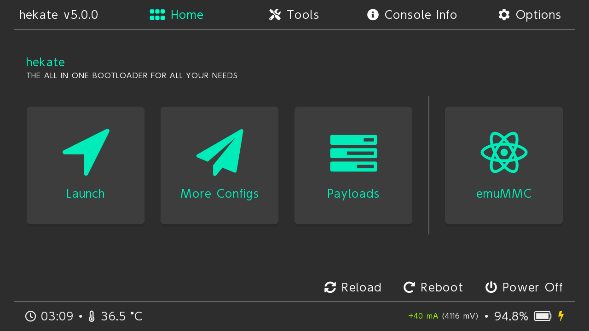

Bitcoin node on Nintendo Switch
=============

This tutorial will allow you to excute a complete Bitcoin node on Nintendo switch.

Prerequisites
---------------------

- A computer
- A Nintendo Switch (V1)
- A 1TB SD card (Less for a pruned node)
- [Ubuntu Bionic](https://download.switchroot.org/ubuntu-bionic/switchroot-ubuntu-5.1.1-2023-06-12.7z)
- The latest version of [Hekate](https://github.com/CTCaer/hekate/releases)
- A payload sending application for Switch
- [RCM jig](https://www.amazon.com/Switch-Nintendo-Modify-Archive-Simulator/dp/B09GVHZ5B1/ref=sr_1_5?crid=1U506NUGSW4OB&keywords=rcm+switch&qid=1681136130&sprefix=rcm+sw%2Caps%2C443&sr=8-5)

Let's start
---------------------

### Make sure that your switch is a V1

To make sure that a switch is modifiable you can go to this [site](https://ismyswitchpatched.com).

If your Switch is not patched you can continue this guide!

If your Switch is patched you can still use this guide however your Switch will require soldering which will not be covered by this guide. I'll let you do your own research on the subject.

### Put your Switch in RCM mode

Pour commencer il faut faire entrer votre Switch en mode RCM pour cela on va utilser le RCM jig :

1. Drag the jig on the right port of the Switch.
2. Hold the `Vol+` button.
3. While holding the `VOL+` button and press the `Power` button.
4. Release all the buttons.

If your Switch turned on when you press the Power button, it may be that your jig is not pressed enough in the right port or that your Switch is patched.
If after released all the buttons, the screen of your Switch remained black, it is because the operation probably went well.

Now we are going to inject a payload!

### Inject payload

This part depends on your OS and the software you use.

Here is a list of those you can use:
-  [TegraRcmGUI](https://github.com/eliboa/TegraRcmGUI)(Windows)
-  [JTegraNX](https://github.com/dylwedma11748/JTegraNX)(Windows/macOS/Linux)
-  [NXloader](https://github.com/DavidBuchanan314/NXLoader)(Android)

Using the software you have chosen, you will have to inject the `Hekate.bin` payload. (You must have put the content of the Hakate archive at the root of the sd card)

For most software, all you have to do is press a button to inject the payload. I'll let you refer to the documentation of the chosen software.

You should come across this screen:

### Prepare the SD card

**_Be careful_, all the data on your SD card will be erased, it is recommended to use an SD card specifically for this use.**

1. Insert the SD card into the Switch. (If it's not already done)
2. Go to `Tools` -> `Partition SD Card`.
3. Click on `ok` to preserve the files on the card. 
4. Partition the SD card according to the needs of your node, EXT4 is for linux, And FAT32 must be at least 10GB. 
5. Unzip the `Ubuntu bionic` archive and copy it to the SD card. (You can remove the SD card without switching off the Switch)
6. Now go to `Tools` -> `Partition SD Card` -> `Flash linux`.
7. Finally go in `home` -> `Nyx options` -> `Dump Joy-con BT`

### Boot and configure Linux

Now linux should be able to start.

Go to `home` -> `more configuration` -> `Linux`

Once linux has started, follow the on-screen instructions to configure Linux.

It's good linux is installed on your Switch!

### Install Bitcoin Core

On your switch go to the [Bitcoin Knots](https://bitcoinknots.org/files/28.x/28.1.knots20250305/) download page And choose the architecture **aarch64** (Here is version 28.1 of Bitcoin Knots)

### Finalization

And now your node supports the bitcoin network!

You can also use your Switch to store your Bitcoin although I **strongly recommend** that you use a Hardware Wallet.
